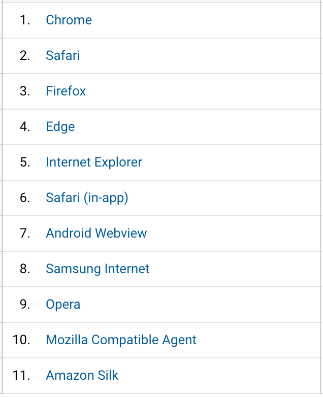
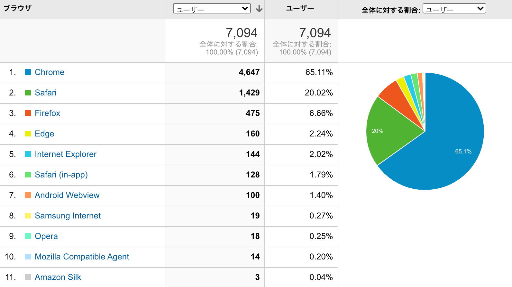

# ブラウザ一覧

- Chrome
- Safari
- Firefox
- Edge
- Internet Explorer
- Safari (in-app)
- Android Webview
- Samsung Internet
- Opera
- Mozilla Compatible Agent
- Amanzon Silk

# Web browser

https://en.wikipedia.org/wiki/Web_browser

ウェブブラウザ（一般にブラウザと呼ばれる）とは、World Wide Web上の情報にアクセスするためのソフトウェアアプリケーションのことである。ユーザーが特定のウェブサイトからウェブページを要求すると、ウェブブラウザはウェブサーバーから必要なコンテンツを取得し、画面にそのページを表示する。

よく混同されているが、ウェブブラウザと検索エンジンは同じものではない[1][2]。しかし、ウェブサイトのサーバーに接続してウェブページを表示するためには、ユーザーはウェブブラウザをインストールしていなければならない[3]。

Webブラウザは、デスクトップ、ラップトップ、タブレット、スマートフォンなど、さまざまなデバイスで利用されている。2019年には、推定43億人がブラウザを使用している[4] 。 最も使用されているブラウザはGoogle Chromeで、全デバイスでの世界シェアは64％、次いでSafariが17％となっている[5]。

## 機能

ウェブブラウザの目的は、ウェブから情報資源を取得し、ユーザーのデバイスに表示することです。

このプロセスは、ユーザーが https://en.wikipedia.org/ のようなユニフォームリソースロケーター (URL) をブラウザに入力したときに始まります。事実上、ウェブ上のすべての URL は http: または https: で始まり、ブラウザはハイパーテキスト転送プロトコル (HTTP) を使用してそれらを取得します。https:の場合、ブラウザとウェブサーバー間の通信は、セキュリティとプライバシーのために暗号化されています。

ウェブページが取得されると、ブラウザのレンダリングエンジンがユーザーのデバイスに表示します。これには、ブラウザがサポートする画像や動画のフォーマットが含まれます。

ウェブページには通常、他のページやリソースへのハイパーリンクが含まれています。各リンクには URL が含まれており、それがクリックまたはタップされると、ブラウザは新しいリソースに移動します。このようにして、コンテンツをユーザーに届けるプロセスが再び始まります。

ほとんどのブラウザは、Web ページのリソースの内部キャッシュを使用して、コンテンツを改善しています。

## 歴史

1993年は、「世界初の人気ブラウザ」としてクレジットされているMosaicのリリースという画期的な年でした[8]。 その革新的なグラフィカル・インターフェースは、World Wide Webシステムを使いやすくし、一般の人がよりアクセスしやすいものにしました。モザイクチームのリーダーであるMarc Andreessenは、すぐに自身の会社であるNetscapeを立ち上げ、1994年にモザイクの影響を受けたNetscape Navigatorをリリースしました。Navigatorはすぐに最も人気のあるブラウザになりました[9]。

Microsoftは1995年にInternet Explorerをデビューさせ、Netscapeとのブラウザ戦争を引き起こした。マイクロソフトが圧倒的な地位を得ることができたのは、2つの理由からである。それは、インターネット・エクスプローラーを人気の高いマイクロソフト・ウィンドウズ・オペレーティング・システムにバンドルしたことと、使用制限のないフリーウェアとして提供したことである。最終的にInternet Explorerの市場シェアは2002年に95%以上のピークを迎えた[10]。

1998年、Netscapeは、オープンソース・ソフトウェア・モデルを使った新しいブラウザを作るために、後にMozilla Foundationとなるものを立ち上げました。この作業は Firefox へと発展し、2004 年に Mozilla によって初めてリリースされた。Firefox の市場シェアは 2011 年に 28% に達した[12]。

Appleは2003年にSafariブラウザをリリースした。Safariは、他の場所では人気が出なかったが、Appleのプラットフォームでは今でも支配的なブラウザである[12]。

Googleは2008年にChromeブラウザをデビューさせ、Internet Explorerから着実にシェアを奪い、2012年には最も人気のあるブラウザとなった[13][14]。 その後もChromeは圧倒的な地位を維持している。

2015年には、Microsoftが新しいブラウザ「Microsoft Edge」を発表した。

技術面では、ブラウザは1990年代以降、HTML、CSS、JavaScript、マルチメディア機能を大幅に拡張してきた。その理由の一つは、ウェブアプリケーションなど、より高度なウェブサイトを可能にしたことだ。もう一つの要因は、ブロードバンド接続が大幅に増加したことで、ダイヤルアップモデム時代には不可能だったYouTubeストリーミングなどのデータ量の多いウェブコンテンツにアクセスできるようになったことだ。

## World Wide Web

https://en.wikipedia.org/wiki/World_Wide_Web

World Wide Web (WWW)、通称ウェブとは、文書やその他のウェブリソースが、ハイパーテキストによって相互にリンクされている可能性のある統一リソースロケータ（URL、https://www.example.com/ など）によって識別され、インターネット上でアクセス可能な情報システムのことである[1][2]。

イギリスのエンジニアでコンピュータ科学者のサー・ティモシー・ジョン・バーナーズ・リーが1989年にワールド・ワイド・ウェブを発明しました。3][4] このブラウザは1991年にCERNの外で公開され、1991年1月から他の研究機関にも公開され、1991年8月には一般の人々にも公開されました。ワールドワイドウェブは情報化時代の発展の中心であり、何十億もの人々がインターネット上で対話するために使用する主要なツールである[5][6][7][8][9]。

Webリソースはダウンロードされたメディアのどのタイプでもよいが、Webページはハイパーテキスト・マークアップ言語（HTML）でフォーマットされたハイパーテキスト・メディアである[10]。 このようなフォーマットにより、URLを含むハイパーリンクが埋め込まれ、ユーザーが他のWebリソースに移動できるようになる。テキストに加えて、ウェブページには、画像、ビデオ、オーディオ、ソフトウェアコンポーネントへの参照が含まれている場合があり、これらは、ユーザーのウェブブラウザにマルチメディアコンテンツの首尾一貫したページとして表示されます。

共通のテーマ、共通のドメイン名、またはその両方を持つ複数のウェブリソースがウェブサイトを構成する。ウェブサイトは、ウェブサーバと呼ばれるプログラムを実行しているコンピュータに格納されており、ユーザのコンピュータ上で実行されているウェブブラウザからのインターネット上の要求に応答する。ウェブサイトのコンテンツは、大部分がパブリッシャーによって提供される場合と、ユーザーがコンテンツを提供する場合と、ユーザーやユーザーの行動に応じてコンテンツが変化するインタラクティブな場合があります。ウェブサイトは、情報提供、娯楽、商業、政府、または非政府の無数の理由で提供されることがあります。

## URL

https://en.wikipedia.org/wiki/URL

統一リソースロケーター(URL)、口語ではウェブアドレスと呼ばれる[1]は、コンピュータネットワーク上の位置とそれを取得するためのメカニズムを指定するウェブリソースへの参照です。URLはUniform Resource Identifier (URI)の特定のタイプであり[2][3]、多くの人がこの2つの用語を互換的に使用していますが[4][a]、URLはWebページを参照するために最も一般的に発生しますが(http)、ファイル転送(ftp)、電子メール(mailto)、データベースアクセス(JDBC)、その他多くのアプリケーションでも使用されています。

ほとんどのウェブブラウザは、アドレスバーのページの上にウェブページのURLを表示します。典型的な URL は http://www.example.com/index.html という形式で、プロトコル (http)、ホスト名 (www.example.com)、ファイル名 (index.html) を示します。

| Status            | Published                                                    |
| :---------------- | ------------------------------------------------------------ |
| First published   | 1994; 26 years ago                                           |
| Latest version    | URL Living Standard April 28, 2020; 16 days ago              |
| Organization      | [Request for Comments](https://en.wikipedia.org/wiki/Request_for_Comments) (RFC) |
| Committee         | [Internet Engineering Task Force](https://en.wikipedia.org/wiki/Internet_Engineering_Task_Force) (IETF) [Web Hypertext Application Technology Working Group](https://en.wikipedia.org/wiki/Web_Hypertext_Application_Technology_Working_Group) (WHATWG) |
| Editors           | [Anne van Kesteren](https://en.wikipedia.org/wiki/Anne_van_Kesteren) |
| Authors           | [Tim Berners-Lee](https://en.wikipedia.org/wiki/Tim_Berners-Lee) |
| Related standards | [URI](https://en.wikipedia.org/wiki/Uniform_Resource_Identifier) , [URN](https://en.wikipedia.org/wiki/Uniform_Resource_Name) |
| Domain            | [World Wide Web](https://en.wikipedia.org/wiki/World_Wide_Web) |
| License           | [CC BY 4.0](https://creativecommons.org/licenses/by/4.0/)    |
| Abbreviation      | URL                                                          |
| Website           | [https://url.spec.whatwg.org](https://url.spec.whatwg.org/)  |

## Uniform Resource Identifier(URI)

https://en.wikipedia.org/wiki/Uniform_Resource_Identifier

統一リソース識別子(Uniform Resource Identifier: URI)は、特定のリソースを明確に識別する文字列である。統一性を保証するために、すべてのURIは事前に定義された構文規則のセット[1]に従うが、個別に定義された階層的な命名スキーム(例: http://)によって拡張性も維持される。

このような識別により、特定のプロトコルを使用して、ネットワーク（一般的にはWorld Wide Web）を介したリソースの表現との相互作用が可能になる。具体的な構文と関連するプロトコルを指定するスキームが各URIを定義する。URIの最も一般的な形式はUniform Resource Locator (URL)であり、非公式にはウェブアドレスと呼ばれることが多い。これは、特定の名前空間にあるリソースを識別するためのメカニズムを提供することで URL を補完するように設計されました。

# Browser engine

https://en.wikipedia.org/wiki/Browser_engine

ブラウザエンジン（レイアウトエンジンやレンダリングエンジンとしても知られています）は、すべての主要なウェブブラウザのコアソフトウェアコンポーネントです。ブラウザエンジンの主な仕事は、ウェブページの HTML ドキュメントやその他のリソースを、ユーザーのデバイス上でインタラクティブな視覚表現に変換することです。

## 名前と範囲

ブラウザエンジンとは、独立したコンピュータプログラムではなく、ウェブブラウザなどの大規模なプログラムの重要な部分のことで、この用語の由来となっています。(「エンジン」という言葉は、自動車のエンジンに例えられています)。

「ブラウザエンジン」の他にも、関連する概念については2つの用語が一般的に使用されています。"レイアウトエンジン」と「レンダリングエンジン」です[1][2][3] 理論的には、レイアウトとレンダリング（または「ペイント」）は別々のエンジンで処理することができます。しかし、実際には両者は密接に結びついており、別々に考えられることはほとんどありません。

レイアウトとレンダリングに加えて、ブラウザエンジンはドキュメント間のセキュリティポリシーを強制し、ハイパーリンクやフォームから送信されたデータを介したナビゲーションを処理し、ページスクリプトに公開されているドキュメントオブジェクトモデル（DOM）データ構造を実装します。

しかし、JavaScript (JS) コードの実行は別問題であり、主要な Web ブラウザはすべてこのための専用エンジンを使用しています。JS言語はもともとブラウザで使用するために作られたものですが、現在では他の場所でも使用されているため、JSエンジンの実装はブラウザエンジンから切り離されています。ウェブブラウザでは、2つのエンジンは共有されたDOMデータ構造を介して協調して動作します。

ブラウザエンジンは、ウェブブラウザ以外にも他の種類のプログラムでも使用されています。メールクライアントは、HTMLメールを表示するためにブラウザエンジンを必要とします。Google Chromeブラウザの2つのエンジンによって駆動されるElectronフレームワークは、多くのアプリケーションを作成するために使用されてきました。

## レイアウトとレンダリング

ウェブページのレイアウトは、一般的にCascading Style Sheets (CSS)によって指定されます。各スタイルシートは、ブラウザエンジンが解釈する一連のルールです。例えば、いくつかの規則では、フォント、色、テキストサイズなどのタイポグラフィの詳細を指定しています。エンジンは、関連するすべてのCSSルールを組み合わせて、画面上に表示される視覚的な表現のための正確なグラフィック座標を計算します[1]。

エンジンによっては、ページのリソースがすべてダウンロードされる前にレンダリングを開始する場合があります。これは、画像が徐々に埋められたり、スタイル化されていないコンテンツが点滅したりするなど、より多くのデータが受信されるにつれて視覚的な変化をもたらす可能性があります。

## 注目すべきエンジン

Gecko は Mozilla のブラウザエンジンで、Firefox ウェブブラウザ、Thunderbird 電子メールクライアント、SeaMonkey インターネットスイートで使用されています[2]。 Goanna は Pale Moon ブラウザで使用されている Gecko のフォークです[3]。

AppleはKDEプロジェクトのKHTMLエンジンをフォークすることで、Safariブラウザ用のWebKitエンジンを作成しました[5]。

GoogleはもともとChromeブラウザにWebKitを使用していたが、最終的にはそれをフォークしてBlinkエンジンを作成した[6] 。 CEF、Electron、またはChromiumを組み込んだ他のフレームワークで構築されたアプリケーションと同様に、すべてのChromiumベースのブラウザはBlinkを使用している。

AppleはiOSデバイスでSafariの代替としてサードパーティ製ブラウザを許可しているが、App Storeで配布されるすべてのブラウザは、そのエンジンとしてWebKitを使用しなければならない。例えば、iOS用のOpera MiniはWebKitを使用していますが、その他のOperaはすべてBlinkを使用しています（Operaは以前は独自に開発したPressureを使用していました）。(Opera は以前は独自の Presto エンジンを使用していました)。

Microsoft は、Trident エンジンの後継である独自の EdgeHTML エンジンを維持しています。しかし、EdgeブラウザがBlinkエンジンでリメイクされたため、EdgeHTMLは現在、Universal Windowsプラットフォームのアプリにのみ使用されています[7][8]。

## Layout 

https://en.wikipedia.org/wiki/Layout_(computing)

コンピューティングでは、レイアウトとは、様々な制約のもとで空間内のオブジェクトの位置を計算するプロセスです。この機能は、アプリケーションの一部として、または再利用可能なコンポーネントやライブラリとしてパッケージ化することができます。

## Gecko

https://en.wikipedia.org/wiki/Gecko_(software)

Gecko は Mozilla が開発したブラウザエンジンです。Firefox ブラウザ、Thunderbird メールクライアント、その他多くのプロジェクトで使用されています。

Gecko はオープンなインターネット標準をサポートするように設計されており、さまざまなアプリケーションでウェブページを表示したり、場合によってはアプリケーションのユーザインタフェースそのものを (XUL をレンダリングすることで) 表示したりするために使用されます。Gecko は豊富なプログラミング API を提供しており、Web ブラウザ、コンテンツ表示、クライアント/サーバなどのインターネット対応アプリケーションの様々な役割に適しています[3]。

Gecko は C++ と JavaScript[4][5] で書かれており、2016 年からはさらに Rust で書かれています[6][7] Mozilla パブリックライセンスバージョン 2 の条件に従うフリーでオープンソースのソフトウェアです[8] Mozilla は公式に Android、[4] Linux、macOS、Windows での使用をサポートしています[9]。

### 歴史

現在Geckoとして知られているレイアウトエンジンの開発は、NetscapeがDigitalStyleを買収した後の1997年に開始されました。既存の Netscape レンダリングエンジンは、元々 Netscape Navigator 1.0 用に書かれ、何年にもわたってアップグレードされてきましたが、速度が遅く、W3C の標準にうまく準拠しておらず、ダイナミック HTML のサポートが限られており、インクリメンタル・リフロー (新しいデータがダウンロードされてページに追加されたときに、レイアウトエンジンが画面上の要素を再配置すること) のような機能がありませんでした。新しいレイアウト・エンジンは古いものと並行して開発され、Netscape Communicatorが成熟して安定したときに統合することを意図していました。少なくとも、Netscapeの主要な改訂版が、切り替えの前に古いレイアウトエンジンを使ってリリースされることが期待されていました。

1998年初頭のMozillaプロジェクトの立ち上げの後、新しいレイアウトエンジンのコードはオープンソースのライセンスでリリースされました。最初はRaptorとして発表されましたが、商標の問題でNGLayout (次世代レイアウト)に名前を変更しなければなりませんでした。Netscape は後に NGLayout を Gecko として再ブランド化しました。Mozilla Organization (Mozilla Foundation の前身) は当初 NGLayout の名前を使い続けていましたが(Gecko は Netscape の商標でした)、[10]、最終的には Gecko のブランディングが勝ってしまいました。

1998年10月、Netscape は、次のブラウザは古いレイアウトエンジンではなく Gecko (当時はまだ NGLayout と呼ばれていました) を使うことを発表しましたが、これはアプリケーションの大部分を書き換える必要がありました。この決定はウェブ標準の支持者には人気がありましたが、ネットスケープの開発者には大部分が不評で、書き換えに与えられた半年間に不満を持っていました。2000年11月、Geckoを組み込んだ最初のNetscapeのリリースであるNetscape 6がリリースされました (Netscape 5という名前は決して使われませんでした)。

Gecko の開発が続くにつれ、他のアプリケーションやエンベッダが Gecko を利用するようになりました。この頃には Netscape の親会社である America Online は、最終的に CompuServe 7.0 と AOL for Mac OS X (これらの製品には以前に Internet Explorer が組み込まれていました) で使用するために Gecko を採用しました。しかし、いくつかのベータ版を除いて、Gecko はメインの Microsoft Windows AOL クライアントで使われることはありませんでした。

2003 年 7 月 15 日、AOL は残りの Gecko 開発者を解雇し、Mozilla Foundation (同日に設立) が Gecko 開発の主な世話役となりました。現在、Gecko は、Mozilla Corporation の従業員、Mozilla プロジェクトに貢献する企業の従業員、ボランティアによって開発されています。

2016年10月、Mozillaは「Firefoxユーザーのための次世代ウェブエンジンを構築する」ために、いくつかのソフトウェア開発の取り組みを包括した進行中のプロジェクト「Quantum」を発表した。これには、実験的な Servo プロジェクトから取った Gecko への多数の改良が含まれています[12][13] 2017 年 11 月に初出荷される Firefox 57 は、「Firefox Quantum」とも呼ばれ、Quantum/Servo プロジェクトからの主要コンポーネントが有効化された初期バージョンとなっています。これらには、CSSやGPUレンダリングコンポーネントのパフォーマンス向上が含まれている。追加のコンポーネントは今後のバージョンで Servo から Gecko へと段階的にマージされていく予定です[12]。

2018年9月、MozillaはGeckoをAndroidで再利用可能にするソフトウェアライブラリをベースにしたMozillaの次世代モバイル製品の基盤となるGeckoViewを発表し、「エンジン自体をユーザーインターフェースから切り離し、他のアプリケーションに組み込みやすいようにした」という新しいソフトウェア開発の取り組みを内包した。同月に出荷されたFirefox Focus 7.0[14]はGeckoViewを導入した最初のバージョンで、ページの中央部の読み込み性能が向上した[15][16] Firefox RealityもGeckoViewで構築された[15] 2019年6月、MozillaはGeckoViewを使ったAndroidウェブブラウザの構築に焦点を当てた進行中のプロジェクトとしてFirefox Previewを発表した[17]。

# JavaScript engine

https://en.wikipedia.org/wiki/JavaScript_engine

JavaScriptエンジンとは、JavaScript（JS）コードを実行するコンピュータプログラムである。最初のJavaScriptエンジンは単なるインタプリタでしたが、関連する現代のエンジンはすべて、パフォーマンスを向上させるためにジャストインタイムコンパイルを利用しています[1]。

JavaScriptエンジンは一般的にWebブラウザのベンダーによって開発されており、主要なブラウザには必ず搭載されています。ブラウザでは、JavaScriptエンジンは、ドキュメントオブジェクトモデルを介してレンダリングエンジンと協調して動作します。

JavaScriptエンジンの使用はブラウザに限定されません。例えば、Chrome V8エンジンは、人気の高いNode.jsランタイムシステムのコアコンポーネントです。

ECMAScript（ES）はJavaScriptの標準仕様なので、ECMAScriptエンジンはこれらのエンジンの別称です。

#### 歴史

最初の JavaScript エンジンは、1995 年に Brendan Eich によって Netscape Navigator ウェブブラウザ用に作成されました。これは Eich が発明した新興言語の初歩的なインタプリタでした。(これは SpiderMonkey エンジンへと発展し、現在でも Firefox ブラウザで使われています)。

最初の近代的なJavaScriptエンジンは、GoogleがChromeブラウザのために作ったV8でした。V8は2008年にChromeの一部としてデビューし、そのパフォーマンスはそれ以前のどのエンジンよりもはるかに優れていました[2][3] 重要な技術革新は、実行時間を大幅に改善できるジャストインタイムのコンパイルでした。

他のブラウザベンダは、競争に勝つためにインタープリタをオーバーホールする必要がありました[4] AppleはSafariブラウザ用にNitroエンジンを開発しましたが、これは前任者よりも30%性能が向上していました[5] MozillaはNitroの一部を利用して独自のSpiderMonkeyエンジンを改善しました[6]。

2017年以降、これらのブラウザではWebAssemblyのサポートが追加されました。これにより、ページスクリプトのパフォーマンスが重要な部分にコンパイル済みの実行ファイルを使用できるようになりました。JavaScriptエンジンは、通常のJavaScriptコードと同じサンドボックスでWebAssemblyコードを実行します。

#### 注目すべきエンジン

- Google の V8 は最も使用されている JavaScript エンジンです。Google Chromeや他の多くのChromiumベースのブラウザ、CEFやElectron、その他Chromiumを組み込んだフレームワークで構築されたアプリケーションでも使用されています。その他の用途としては、Node.jsランタイムシステムなどがあります。
- SpiderMonkey は Mozilla によって開発され、Firefox とそのフォークで使用されています。GNOME Shell は拡張機能のサポートに使用しています。
- JavaScriptCore は Apple の Safari ブラウザ用のエンジンです。他の WebKit ベースのブラウザでも使用されています。KDEのKJSが開発の出発点となった[7]。
- ChakraはInternet ExplorerブラウザのJavaScriptエンジンである。MicrosoftがオリジナルのEdgeブラウザ用にフォークしたものでもあるが、Edgeは後にChromiumベースのブラウザとして再構築されたため、現在ではV8を使用している[8][9]。
- FacebookはReact Nativeフレームワークを使ってAndroidアプリ用のHermesエンジンを作成した[10]。

# ブラウザ一覧

## Google Chrome

https://en.wikipedia.org/wiki/Google_Chrome

Google Chromeは、Googleが開発したクロスプラットフォームのウェブブラウザです。2008年にMicrosoft Windows向けにリリースされ、後にLinux、macOS、iOS、Androidに移植された。ブラウザはChrome OSの主要コンポーネントでもあり、ウェブアプリのプラットフォームとして機能しています。

ChromeのソースコードのほとんどはGoogleのオープンソースのChromiumプロジェクトから来ているが、Chromeはプロプライエタリなフリーウェアとしてライセンスされている[14] 。

StatCounterによると、2020年4月現在、Chromeの世界的なブラウザ市場シェアは、従来型PCで68％（72％をピークに）、全プラットフォームで64％と推定されている[16][17]。 この成功を受けて、Googleは「Chrome」のブランド名を他の製品にも拡大している。Chrome OS、Chromecast、Chromebook、Chromebit、Chromebox、Chromebase。

| [Developer(s)](https://en.wikipedia.org/wiki/Software_developer) | [Google LLC](https://en.wikipedia.org/wiki/Google_LLC)       |
| :----------------------------------------------------------- | ------------------------------------------------------------ |
| Initial release                                              | September 2, 2008; 11 years ago                              |
| [Stable release(s)](https://en.wikipedia.org/wiki/Software_release_life_cycle) [[±\]](https://en.wikipedia.org/wiki/Template:Latest_stable_software_release/Google_Chrome?action=edit) | Windows, macOS, Linux81.0.4044.141 / May 14, 2020; 1 day ago[[1\]](https://en.wikipedia.org/wiki/Google_Chrome#cite_note-Stable-1)Android81.0.4044.138 / May 5, 2020; 10 days ago[[2\]](https://en.wikipedia.org/wiki/Google_Chrome#cite_note-2)iOS81.0.4044.124 / April 21, 2020; 24 days ago[[3\]](https://en.wikipedia.org/wiki/Google_Chrome#cite_note-3) |
| [Preview release(s)](https://en.wikipedia.org/wiki/Software_release_life_cycle) [[±\]](https://en.wikipedia.org/wiki/Template:Latest_preview_software_release/Google_Chrome?action=edit) | Beta (Windows, macOS, Linux)83.0.4103.56 / May 13, 2020; 2 days ago[[4\]](https://en.wikipedia.org/wiki/Google_Chrome#cite_note-BetaReleases-4)Beta (Android)83.0.4103.56 / May 14, 2020; 1 day ago[[5\]](https://en.wikipedia.org/wiki/Google_Chrome#cite_note-BetaAndroidReleases-5)Beta (iOS)83.0.4103.56 / May 13, 2020; 2 days ago[[6\]](https://en.wikipedia.org/wiki/Google_Chrome#cite_note-PreviewReleases-6)Dev (Windows, macOS, Linux)84.0.4143.2 / May 12, 2020; 3 days ago[[7\]](https://en.wikipedia.org/wiki/Google_Chrome#cite_note-DevReleases-7)Dev (Android)84.0.4142.0 / May 12, 2020; 3 days ago[[6\]](https://en.wikipedia.org/wiki/Google_Chrome#cite_note-PreviewReleases-6)Dev (iOS)84.0.4144.0 / May 12, 2020; 3 days ago[[6\]](https://en.wikipedia.org/wiki/Google_Chrome#cite_note-PreviewReleases-6)Canary (Windows, macOS)84.0.4147.0 / May 15, 2020; 0 days ago[[6\]](https://en.wikipedia.org/wiki/Google_Chrome#cite_note-PreviewReleases-6)Canary (Android)84.0.4147.0 / May 15, 2020; 0 days ago[[6\]](https://en.wikipedia.org/wiki/Google_Chrome#cite_note-PreviewReleases-6) |
| Written in                                                   | [C](https://en.wikipedia.org/wiki/C_(programming_language)), [C++](https://en.wikipedia.org/wiki/C%2B%2B), [Java](https://en.wikipedia.org/wiki/Java_(programming_language)) (Android app only), [JavaScript](https://en.wikipedia.org/wiki/JavaScript), [Python](https://en.wikipedia.org/wiki/Python_(programming_language))[[8\]](https://en.wikipedia.org/wiki/Google_Chrome#cite_note-8)[[9\]](https://en.wikipedia.org/wiki/Google_Chrome#cite_note-9)[[10\]](https://en.wikipedia.org/wiki/Google_Chrome#cite_note-10) |
| [Engines](https://en.wikipedia.org/wiki/Software_engine)     | [Blink](https://en.wikipedia.org/wiki/Blink_(browser_engine)) ([WebKit](https://en.wikipedia.org/wiki/WebKit) on iOS), [V8](https://en.wikipedia.org/wiki/V8_(JavaScript_engine)) |
| [Operating system](https://en.wikipedia.org/wiki/Operating_system) | [Android](https://en.wikipedia.org/wiki/Android_(operating_system)) [KitKat](https://en.wikipedia.org/wiki/Android_KitKat) and later[[11\]](https://en.wikipedia.org/wiki/Google_Chrome#cite_note-11)[Chrome OS](https://en.wikipedia.org/wiki/Chrome_OS)[iOS 11](https://en.wikipedia.org/wiki/IOS_11) or later[[12\]](https://en.wikipedia.org/wiki/Google_Chrome#cite_note-iOSlatest-12)[Linux](https://en.wikipedia.org/wiki/Linux)[macOS 10.10](https://en.wikipedia.org/wiki/OS_X_Yosemite) or later[Windows 7](https://en.wikipedia.org/wiki/Windows_7) or later |
| [Platform](https://en.wikipedia.org/wiki/Computing_platform) | [IA-32](https://en.wikipedia.org/wiki/IA-32), [x86-64](https://en.wikipedia.org/wiki/X86-64), [ARMv7](https://en.wikipedia.org/wiki/ARMv7), [ARMv8-A](https://en.wikipedia.org/wiki/ARMv8-A) |
| Included with                                                | [Android Jelly Bean](https://en.wikipedia.org/wiki/Android_(operating_system)) or later[Chrome OS](https://en.wikipedia.org/wiki/Chrome_OS) |
| Available in                                                 | 47 languages[[13\]](https://en.wikipedia.org/wiki/Google_Chrome#cite_note-13) |
| [Type](https://en.wikipedia.org/wiki/Software_categories#Categorization_approaches) | [Web browser](https://en.wikipedia.org/wiki/Web_browser), [mobile browser](https://en.wikipedia.org/wiki/Mobile_browser) |
| [License](https://en.wikipedia.org/wiki/Software_license)    | [Proprietary](https://en.wikipedia.org/wiki/Proprietary_software) [freeware](https://en.wikipedia.org/wiki/Freeware), based on open source components.[[14\]](https://en.wikipedia.org/wiki/Google_Chrome#cite_note-TOS-14)[[note 1\]](https://en.wikipedia.org/wiki/Google_Chrome#cite_note-15) |
| Website                                                      | [www.google.com/chrome/](https://www.google.com/chrome/)     |

### Blink

https://en.wikipedia.org/wiki/Blink_(browser_engine)

Blinkはブラウザエンジンである。Chromiumプロジェクトの一環として開発されており[2]、Google、Facebook、Microsoft、Opera Software、Adobe Systems、Intel、IBM、Samsungなどが貢献している[3][4]。 2013年4月に初めて発表された[5]。

BlinkはWebKitのWebCoreコンポーネントのフォークであり[6]、元々はKDEのKHTMLとKJSライブラリのフォークでした[7][8]。

WebCoreのコードの多くは、サンドボックスやマルチプロセスモデルなど、Google Chromeが実装している機能に使用されています。これらの部分はBlinkフォーク用に変更され、少しかさばりましたが、新しい機能を追加するための柔軟性が高まりました。既存のプレフィックスは段階的に廃止され、代わりに新しい実験的な機能がオプトインベースで有効になります[12]。 これらの計画的な変更を除けば、Blinkは当初はWebCoreと比較的類似しています[10]。 コミット数では、Googleは2009年後半以降、WebKitのコードベースへの最大の貢献者となっています[13]。

Blinkの命名は、Netscape Navigatorによって導入され、2013年8月までPrestoとGeckoベースのブラウザでサポートされていた非標準のpresentational blink HTML要素の影響を受けています。Blinkはその名前に反して、この要素を機能的にサポートしたことはありません[2][14][15]。

| [Developer(s)](https://en.wikipedia.org/wiki/Software_developer) | The [Chromium](https://en.wikipedia.org/wiki/Chromium_(web_browser)) Project and contributors |
| :----------------------------------------------------------- | ------------------------------------------------------------ |
| Initial release                                              | April 3, 2013; 7 years ago[[1\]](https://en.wikipedia.org/wiki/Blink_(browser_engine)#cite_note-1) |
| [Repository](https://en.wikipedia.org/wiki/Repository_(version_control)) | [chromium.googlesource.com/chromium/src/+/master/third_party/blink/](https://chromium.googlesource.com/chromium/src/+/master/third_party/blink/) |
| Written in                                                   | [C++](https://en.wikipedia.org/wiki/C%2B%2B)                 |
| [Type](https://en.wikipedia.org/wiki/Software_categories#Categorization_approaches) | [Browser engine](https://en.wikipedia.org/wiki/Browser_engine) |
| [License](https://en.wikipedia.org/wiki/Software_license)    | [BSD](https://en.wikipedia.org/wiki/BSD_licenses) and [LGPLv2.1](https://en.wikipedia.org/wiki/GNU_Lesser_General_Public_License) |
| Website                                                      | [chromium.org/blink](https://chromium.org/blink)             |

### WebKit

https://en.wikipedia.org/wiki/WebKit

WebKitはAppleが開発したブラウザエンジンで、主にSafariのWebブラウザやすべてのiOSのWebブラウザで使用されています。WebKit は、BlackBerry ブラウザ、Tizen モバイル オペレーティング システム、Amazon Kindle 電子書籍リーダーに含まれるブラウザでも使用されています。WebKit の C++ アプリケーション・プログラミング・インターフェース (API) は、Web コンテンツをウィンドウに表示するためのクラスのセットを提供し、ユーザーがクリックしたときのリンクの追跡、バックフォワード・リストの管理、最近訪問したページの履歴の管理などのブラウザ機能を実装しています。

WebKit の HTML と JavaScript エンジンは、KDE の KHTML と KJS ライブラリのフォークとして始まり[1][6]、その後、KDE の貢献者、Apple、Google、Nokia、Bitstream、BlackBerry、Igalia などによってさらに開発されてきました[7]。 WebKitはmacOS、Windows、Linux、その他様々なUnix系OSをサポートしている[8]。 2013年4月3日、GoogleはWebKitのコンポーネントであるWebCoreをフォークし、Google ChromeやOperaウェブブラウザの将来のバージョンで使用するためにBlinkという名前で使用することを発表した[9][10]。

WebKit は BSD 形式のライセンス[11] で提供されていますが、WebCore と JavaScriptCore のコンポーネントは GNU Lesser General Public License で提供されています。2013年3月7日現在、WebKitはAppleの商標であり、米国特許商標庁に登録されています[12]。

#### Origin

WebKitとなるコードは、1998年にKDE HTML（KHTML）レイアウトエンジンとKDE JavaScript（KJS）エンジンとして始まりました。WebKitプロジェクトは2001年6月25日にDon Meltonによって、KHTMLとKJSのフォークとしてApple社内で開始されました[13]。Melton氏はKDE開発者への電子メール[1]で、KHTMLとKJSは小さく（14万行以下のコード）、きれいに設計され、標準に準拠していることから、他の利用可能な技術よりも開発が容易であると説明しました。KHTMLとKJSはアダプタライブラリの助けを借りてOS Xに移植され、WebCoreとJavaScriptCoreに改名されました[1] 。JavaScriptCoreは2002年6月にKDEのメーリングリストへの電子メールで発表され、Appleの変更点の最初のリリースと同時に発表されました[14] 。JavaScriptCoreはMac OS X v10.2にプライベートフレームワークとして最初に含まれており、AppleはSherlockアプリケーションで使用していました。Mac OS X v10.3は、Appleのオペレーティングシステムで初めてWebKitをバンドルしたメジャーリリースでした。

Apple によると、いくつかの変更点は、KDE の KHTML にはない OS X 固有の機能（Objective-C、KWQ、OS X 呼び出し[15]など）に関係しており、異なる開発戦術が必要とされていました[16]。

#### Googleによるフォーク

2013年4月3日、GoogleはWebKitのWebCoreコンポーネントのフォークを作成することを発表しました。Chromeの開発者がフォークを決定したのは、WebCoreの機能を上流でコンフリクトを起こすことなく自由にブラウザに実装できるようにすることと、Chromeで使われていないWebCoreコンポーネントのコードを削除してコードベースを簡素化できるようにするためだという。今年初めにOpera SoftwareがChromiumコードベースを利用してWebKitに移行すると発表したことに関連して、OperaウェブブラウザもBlinkに移行することが確認されました[42]。 この発表を受けて、WebKitの開発者はコードベースを合理化するために、エンジンからChrome固有のコードを削除する議論を始めました[70]。WebKit には Chrome 固有のコード（ビルドシステム、V8 JavaScript エンジンフック、プラットフォームコードなど）がなくなりました。

#### WebCore

WebCoreは、WebKitプロジェクトによって開発されたHTMLおよびScalable Vector Graphics (SVG)用のレイアウト、レンダリング、およびDocument Object Model (DOM)ライブラリです。その完全なソースコードは、GNU Lesser General Public License (LGPL) の下でライセンスされています。WebKit フレームワークは WebCore と JavaScriptCore をラップし、C++ ベースの WebCore レンダリングエンジンと JavaScriptCore スクリプトエンジンに Objective-C アプリケーションプログラミングインターフェースを提供し、Cocoa API ベースのアプリケーションから簡単に参照できるようにしています; それ以降のバージョンでは、クロスプラットフォームの C++ プラットフォームの抽象化も含まれており、様々なポートがより多くの API を提供しています。

WebKit は Acid2 と Acid3 のテストに合格しており、リファレンスハードウェア上では、ピクセルパーフェクトなレンダリングとタイミングや滑らかさの問題はありません[71]。

#### JavaScriptコア

JavaScriptCoreはWebKit実装用のJavaScriptエンジンを提供するフレームワークであり、macOS内の他のコンテキストでもこのタイプのスクリプトを提供しています[14][72] JavaScriptCoreはもともとKDEのJavaScriptエンジン（KJS）ライブラリ（KDEプロジェクトの一部）とPCRE正規表現ライブラリから派生したものです。KJSとPCREをフォークして以来、JavaScriptCoreは多くの新機能と大幅に改善されたパフォーマンスで改良されてきました[73]。

2008年6月2日、WebKitプロジェクトはJavaScriptCoreをバイトコードインタプリタ「SquirrelFish」として書き換えたことを発表しました[31][32]。

FTLという名前の最適化ジャストインタイム（JIT）コンパイラが2014年5月13日に発表された[74] 。"FTL "は "Fourth-Tier-LLVM "の略で、非公式には faster-than-light の略で、その速さを暗示している。 [75] 2016年2月15日現在、FTL JITのバックエンドは "Bare Bones Backend"（略してB3）に置き換えられている[76]。

#### 分割開発

WebCoreとKHTMLの間のコード交換は、コーディングやコード共有のアプローチが異なるため、コードベースが分岐し、ますます困難になりました[17]。 ある時点で、KHTMLの開発者はAppleの変更を受け入れられないと言い、2つのグループ間の関係は「苦い失敗」だと主張しました[18]。 Appleは、変更点を大規模なパッチで提出しましたが、その中には非常に多くの変更点が含まれており、不十分なドキュメントが含まれていることが多く、多くの場合、将来の追加に関するものでした。そのため、これらのパッチはKDEの開発者がKHTMLに統合するのが困難でした[19] また、Appleは開発者に対して、Appleのソースコードを見る前に秘密保持契約に署名するよう要求していました。

公表された「離婚」の期間中、KDE開発者のKurt Pfeifle (pipitas)が記事を投稿し、KHTML開発者は、WebCoreからKHTMLへのSafariの改良の多く（すべてではありませんが）をバックポートすることに成功しており、彼らは常にAppleからの改良を評価しており、今でもそうしていると主張しています。この記事では、Apple が KHTML 開発者と連絡を取り合い、相互の関係を改善する方法や将来の協力の方法について話し合うようになったことにも言及しています[21]。 実際、KDE プロジェクトでは、これらの変更のいくつかを取り入れて KHTML のレンダリング速度を改善し、Acid2 レンダリングテストへの準拠などの機能を追加することができました[22]。

このフォークが登場したという話を受けて、AppleはWebKitフォークのソースコードの変更点をリビジョンコントロールの公開リポジトリで公開した[23]。多くのKHTML開発者がWebKitリビジョンコントロールリポジトリのレビュアーやサブミット者になっています[citation needed]。

また、WebKit チームは、オリジナルの WebKit コードベースの多くの Apple 固有の変更を反転させ、プラットフォーム固有の抽象化レイヤーを実装して、コアレンダリングコードを他のプラットフォームにコミットするのを大幅に容易にしました[24]。

2007年7月、Ars TechnicaはKDEチームがKHTMLからWebKitに移行すると報じました[25]。 代わりに、数年にわたる統合の後、2010年8月にWebKitとKHTMLの両方をサポートするKDE Development Platformバージョン4.5.0がリリースされ、KHTMLの開発が続けられています[26]。

### オープンソース

2005年6月7日、Safariの開発者であるDave Hyatt氏は、AppleがWebKitをオープンソース化し（以前はWebCoreとJavaScriptCoreのみがオープンソース化されていた）、WebKitのリビジョン管理ツリーとイシュートラッカーへのアクセスを開放したことを自身のウェブログで発表しました[23]。 これは、AppleのWorldwide Developers Conference 2005において、Appleのソフトウェアエンジニアリング担当上級副社長であるBertrand Serlet氏によって発表されました。

2005年12月中旬には、Scalable Vector Graphics (SVG) のサポートが標準ビルドにマージされ[27]、2006年1月上旬にはソースコードが Concurrent Versions System (CVS) から Subversion (SVN) に移行されました。

WebKit の JavaScriptCore と WebCore コンポーネントは GNU Lesser General Public License の下で利用可能であり、WebKit の残りの部分は BSD スタイルのライセンスで利用可能です。

## Safari

## Firefox

## Edge

## Internet Explorer

## Safari (in-app)

## Android Webview

## Samsung Internet

## Opera

## Mozilla Compatible Agent

## Amanzon Silk